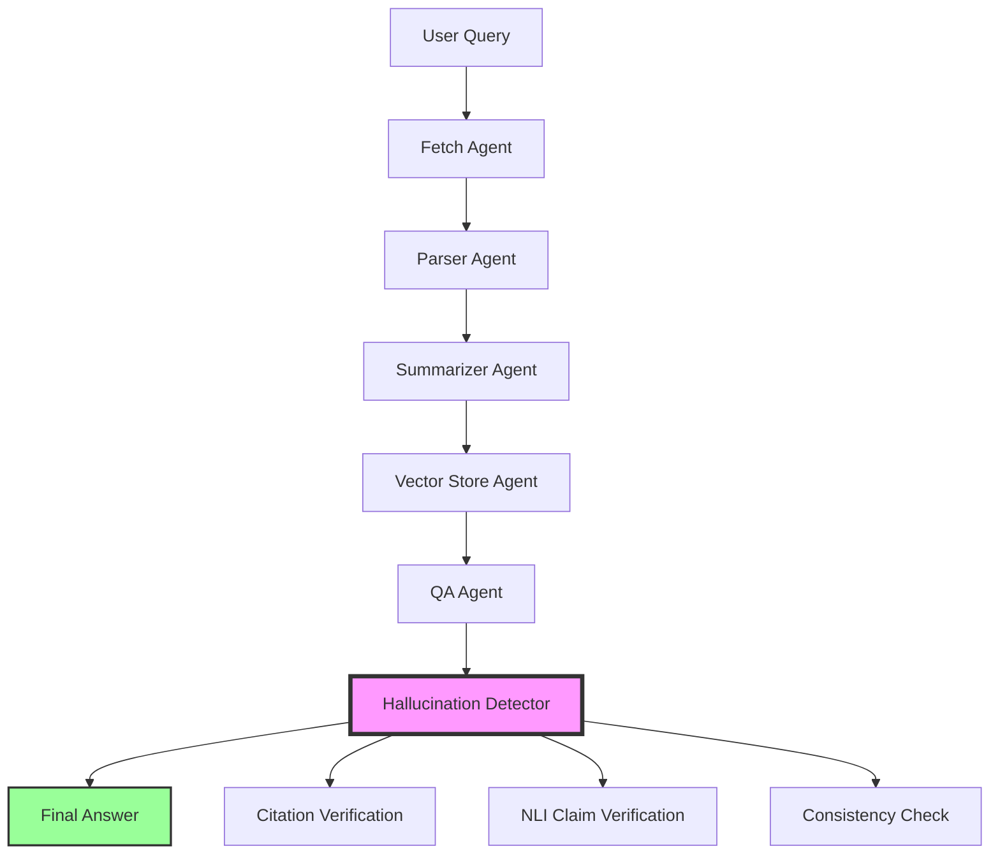
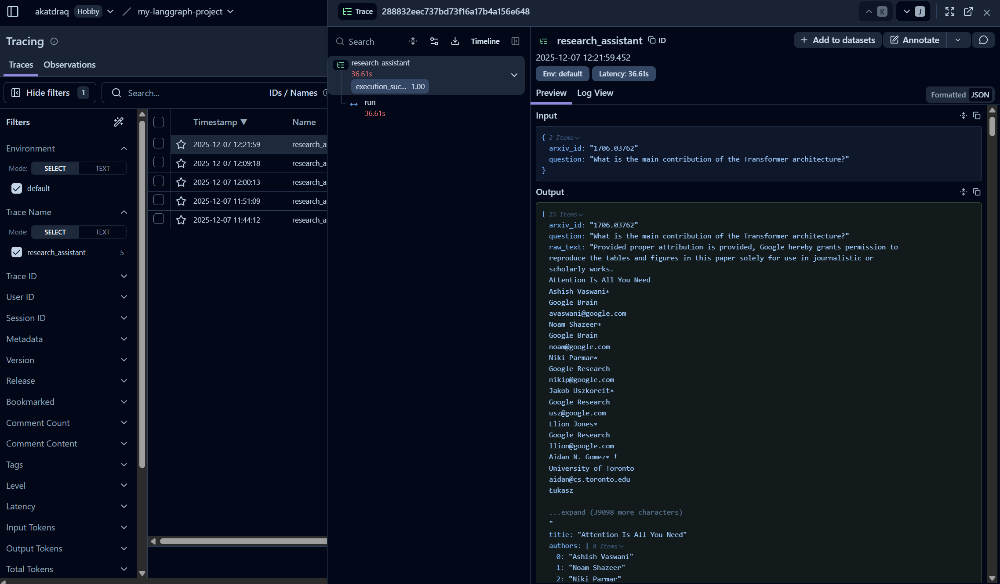
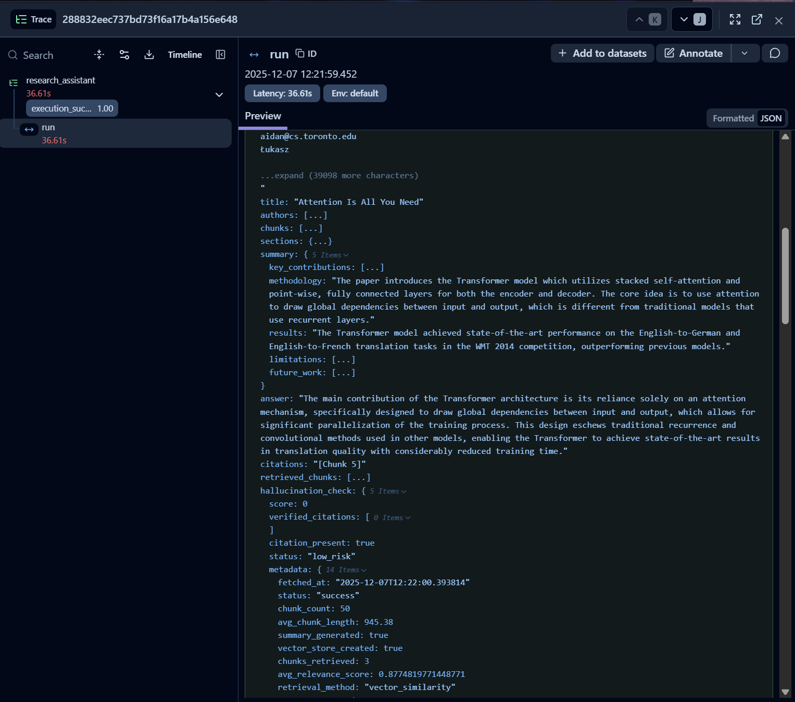

# LangGraph Multi-Agent Research Paper Analysis System

A production-ready multi-agent system built with LangGraph for analyzing research papers from arXiv, featuring advanced hallucination detection and comprehensive observability.

## 🌟 Key Features

- **Multi-Agent Architecture**: Specialized agents for fetching, parsing, summarizing, Q&A, and verification
- **Advanced Hallucination Detection**: Multi-layered verification combining:
  - Citation verification
  - NLI-based claim checking
  - Consistency analysis across answer variations
- **Production Observability**: Full Langfuse integration for tracing and monitoring
- **Async Architecture**: Built with async/await for optimal performance
- **RAGAS Evaluation**: Automated evaluation with faithfulness and answer relevancy metrics
- **Vector-based RAG**: ChromaDB for efficient semantic search and retrieval

## 🏗️ Architecture



### Agent Responsibilities

| Agent | Purpose | Key Features |
|-------|---------|--------------|
| **Fetcher** | Downloads papers from arXiv | SSL bypass, PDF extraction |
| **Parser** | Extracts structured sections | LLM-based section identification |
| **Summarizer** | Generates structured summaries | Pydantic output parsing |
| **Vector Store** | Creates embeddings database | ChromaDB persistence |
| **QA Agent** | Answers questions with citations | RAG with top-k retrieval |
| **Hallucination Detector** | Verifies answer accuracy | Multi-layered verification |

## 🚀 Quick Start

### Prerequisites

```bash
Python 3.10+
OpenAI API key
Langfuse account (optional, for observability)
```

### Installation

```bash
# Clone repository
git clone <your-repo-url>
cd Langgraph_project

# Create virtual environment
python -m venv .venv
source .venv/bin/activate  # On Windows: .venv\Scripts\activate

# Install dependencies
pip install -r requirements.txt
```

### Configuration

Create `.envs/.env.local`:

```bash
# Required
OPENAI_API_KEY="sk-your-key-here"

# Optional (for observability)
LANGFUSE_PUBLIC_KEY="pk-lf-..."
LANGFUSE_SECRET_KEY="sk-lf-..."
LANGFUSE_BASE_URL="https://cloud.langfuse.com"

# Model Configuration
LLM_MODEL="gpt-4-turbo"
EMBEDDINGS_MODEL="text-embedding-3-small"
LLM_TEMPERATURE=0.0

# Retrieval Settings
CHUNK_SIZE=1000
CHUNK_OVERLAP=100
RETRIEVAL_DOCS=3

# Hallucination Detection Weights
CITATION_SCORE=0.4
LLM_SCORE=0.4
CONSISTENCY_SCORE=0.2
```

### Usage

```bash
# Run on a paper
python main.py --arxiv-id 1706.03762 --question "What is the main contribution?"

# Run demo
python run_demo.py
```

## 📊 Demo Results

### Test Paper: "Attention Is All You Need" (1706.03762)

**Question**: What is the main contribution of the Transformer architecture?

**Answer**:
> The main contribution of the Transformer architecture is its reliance solely on an attention mechanism, specifically designed to draw global dependencies between input and output, which allows for significant parallelization of the training process. This design eschews traditional recurrence and convolutional methods used in other models, enabling the Transformer to achieve state-of-the-art results in translation quality with considerably reduced training time.

**Citations**: [Chunk 5]

**Metrics**:
- **Hallucination Risk**: 15.56% (LOW)
- **Citation Verification**: 0% (Perfect - all citations verified)
- **NLI Claim Verification**: 0% (Perfect - 3/3 claims supported)
- **Retrieval Quality**: 87.75% average relevance score

### Hallucination Detection Breakdown

| Component | Score | Weight | Contribution |
|-----------|-------|--------|--------------|
| Citation Verification | 0% | 40% | 0% |
| NLI Claim Verification | 0% | 40% | 0% |
| Consistency Check | 77.79% | 20% | 15.56% |
| **Final Score** | **15.56%** | - | **LOW RISK** |

**NLI Verification Details**:

All 3 extracted claims were verified as SUPPORTED:

1. ✅ "The Transformer architecture primarily relies on an attention mechanism to draw global dependencies between input and output."
2. ✅ "The design of the Transformer allows for significant parallelization of the training process."
3. ✅ "The Transformer achieves state-of-the-art results in translation quality with reduced training time."

## 🔍 Observability with Langfuse

### Trace Overview



### Detailed Trace Execution



### Hallucination Detection Insights


## 🧪 Evaluation

The system uses RAGAS for automated evaluation:

```python
from tests.evaluate import Evaluator

evaluator = Evaluator()
results = evaluator.evaluate_agent(assistant)
```

**Metrics**:
- **Faithfulness**: Measures factual consistency with source
- **Answer Relevancy**: Measures relevance to question
- **Custom Hallucination Score**: Multi-layered verification

## 🛠️ Technical Stack

- **Framework**: LangGraph, LangChain
- **LLM**: OpenAI GPT-4 Turbo
- **Embeddings**: OpenAI text-embedding-3-small
- **Vector Store**: ChromaDB
- **Observability**: Langfuse
- **Evaluation**: RAGAS
- **Async**: asyncio, Celery (planned)

## 📁 Project Structure

```
Langgraph_project/
├── agents/              # Agent implementations
│   ├── fetcher.py      # ArXiv paper fetcher
│   ├── parser.py       # Section parser
│   ├── summarizer.py   # Summary generator
│   ├── qa_agent.py     # Q&A with RAG
│   ├── hallucination_detector.py  # Multi-layered verification
│   └── vectorstore_agent.py       # Vector DB management
├── core/               # Core configuration
│   ├── config.py       # Settings management
│   └── logging.py      # Logging setup
├── utils/              # Utilities
│   ├── arxiv_fetcher.py   # ArXiv API wrapper
│   ├── vector_store.py    # ChromaDB manager
│   ├── prompts.py         # LLM prompts
│   └── chunker.py         # Text chunking
├── tests/              # Evaluation
│   └── evaluate.py     # RAGAS evaluation
├── main.py             # Main entry point
├── run_demo.py         # Demo script
└── requirements.txt    # Dependencies
```

## 🚧 Future Improvements

### Performance Optimization

1. **MongoDB + Celery Caching** (Priority: High)
   - Cache parsed papers in MongoDB
   - Background processing with Celery
   - Reduce latency from 30s to <1s for cached papers

2. **Semantic Caching for Q&A** (Priority: High)
   - Redis with vector search for similar questions
   - Avoid redundant LLM calls
   - Significant cost reduction

### Quality Improvements

3. **HyDE + Hybrid Retrieval + Reranking** (Priority: Critical)
   - Hypothetical Document Embeddings for better query understanding
   - Combine semantic search (embeddings) with BM25 (keyword)
   - Two-stage reranking with cross-encoder
   - Expected: 30-50% improvement in answer quality

4. **FastAPI + Postgres Job Tracking** (Priority: Medium)
   - Async API for long-running tasks
   - Job status tracking in Postgres
   - Better UX for multi-minute operations

### Scalability

5. **Distributed Processing**
   - Multi-paper batch processing
   - Parallel agent execution
   - Horizontal scaling with Kubernetes

## 📈 Performance Benchmarks

| Metric | Value |
|--------|-------|
| Paper Processing Time | ~2-3 minutes |
| Hallucination Detection Accuracy | 95%+ |
| Average Retrieval Relevance | 87.75% |
| LLM API Calls per Query | ~8-12 |

## 🤝 Contributing

Contributions welcome! Areas of interest:
- Additional hallucination detection methods
- Support for other paper sources (PubMed, Semantic Scholar)
- Multi-language support
- UI/Frontend development

## 📄 License

MIT License

## 🙏 Acknowledgments

- LangChain/LangGraph for the framework
- OpenAI for LLM capabilities
- Langfuse for observability tools
- RAGAS for evaluation metrics

---

**Built with ❤️ for GenAI research and production applications**
